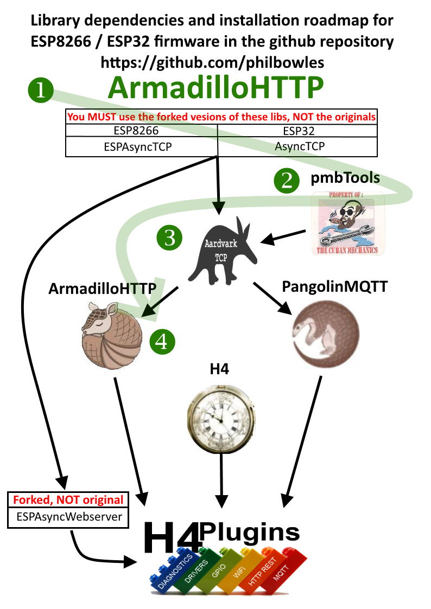
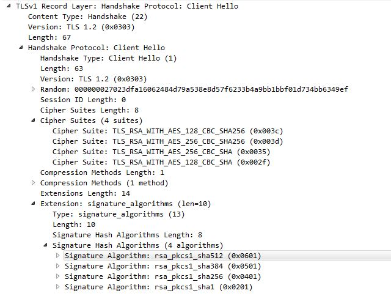

# ArduinoIDE Asynchronous HTTP client library for ESP8266, ESP32

## Version 0.1.2 2/6/2021

Code tidying re std:: prefixing / namespace issues, API/functionality unchanged

## Version 0.1.1

Read [Release Notes 0.1.1](docs/rn011.md)

---

# Contents

* [What does it do?](#what-does-it-do)
* [ArmadilloHTTP's place in "The Menagerie"](#the-menagerie-roadmap)
* [Installation path](#armadillohttp-installation-path)
* [API](#api)
    * [URL Definition](#url-defintion)
    * [Using TLS](#using-tls)
    * ["Pre-flighting" and phases](#pre-flighting-and-phases)
    * [Response Handling](#respsonse-handling)
    * [Functions](#functions)
* [Known issues / limitations](#known-issues--limitations)
* [Problems / support](#problems--support)

---

# What does it do?

ArmadilloHTTP sits on top of [AardvarkTCP](https://github.com/philbowles/AardvarkTCP). It allows you to access remote HTTP/S sites asynchronously with huge* page sizes, using `GET`, `POST`, `PUT`, `PATCH`, `DELETE`, 

*By "huge" we mean any packet that is larger than the total system buffers. If you compile with the "Low Memory" option on ESP8266 this will be 1072 bytes or 2920 with the "Higher Bandwith" options (as at core 2.7.4)

ESP32 and '8266 use LwIP to manage TCP communications. LwIP allows multiple buffers, for ESP8266 it's 2, so what you see in the figures above is 1072=2x536 and 2920=2x1460. The important point here is that *all* of the "magic numbers" 536, 1460 (the individual LwIP buffer size) and 2 (the number of buffers) are implementation-dependent and *could* change in the future, so "hardcoding" any of them into your own app would be a **bad idea** as it could cause problems in the future or prevent your code running on newer / different machines.

If you want code that runs on either ESP32 or ESP8266 with no changes, then you need something that automatically caters for those values and make is so that you can just send and receive without worrying about them.

ArmadilloHTTP solves that problem by allowing data up to aabout half of the free heap to be sent / received, no matter what any of those LwIP "magic numbers" above are. It also provides a very simple interface which seamlessly manages both unencrypted and TLS-encrypted (ESP8266 only) sessions, depending on the URL provided.

## Worth a 1000 words...

This is pretty much all the code you will need. "Here's a URL, work out which protocol it needs, and give me a shout when you have the whole page ready for me". Why should it be any more complicated?

```cpp
#include <ArmadilloHTTP.h>
ArmadilloHTTP aClient;

void responseHandler(ARMA_HTTP_REPLY r){ // r is a struct will all the reply fields you might need
  Serial.printf("\nRaw Data\n");
  dumphex(r.data,r.length);
}

void setup() {
  Serial.begin(115200);
  WiFi.begin("XXXXXXXX", "XXXXXXXX");
  WiFi.waitForConnectResult();
  Serial.printf("Connected %s\n",WiFi.localIP().toString().data());

  aClient.GET("http://robot.local/1328.htm",responseHandler); // <--- Yup, that's pretty much it!
}

void loop() {}
```

---

# The "menagerie" roadmap

ArmadilloHTTP is one of a family of firmware packages for simple *robust* and rapid ***asynchronous*** IOT development on ESP8266 / ESP32


## The related / dependent libraries

|| Name | Provides | Notes |
| :---: | :----------  | :--- | :--- |
||[Forked AsyncTCP](https://github.com/philbowles/AsyncTCP-master)|"Glue" to LwIP (ESP8266)| Important bugfixes |
||[Forked ESPAsyncTCP](https://github.com/philbowles/ESPAsyncTCP-master)|"Glue" to LwIP(ESP32)| Missing features added |
||[Forked ESPAsyncWebserver](https://github.com/philbowles/ESPAsyncWebServer)| Basis of webUI in H4Plugins| Several major bugfixes |
||[PMB Tools](https://github.com/philbowles/pmbtools)|'32/'8266 HAL and utility functions| |
||[AardvarkTCP](https://github.com/philbowles/AardvarkTCP)|Simple Large-payload Async TCP| API-compatible with ESPAsyncTCP, seamless TLS/SSL |
||[PangolinMQTT](https://github.com/philbowles/PangolinMQTT)|Async MQTT Client|QoS 0/1/2 Fully 3.1.1 compliant. Large payloads |
||[ArmadilloHTTP](https://github.com/philbowles/ArmadilloHTTP)|Async HTTP/S Client| Simple send/callback of large payloads |
||[H4](https://github.com/philbowles/H4)|Scheduler/Async Timers| |
||[H4/Plugins](https://github.com/philbowles/h4plugins)|Full Async IOT Firmware| Webserver, MQTT, OTA, NTP, HTTP etc etc |

## ArmadilloHTTP installation path



---

# API

## URL defintion

The url must be specified in the following general form. The extended path and query portions are optional, as is the port. If the port is omitted it will default to 80 for URLs starting `http` and 443 for those starting `https`

`http://hostname:port/path/to/resource?a=b&c=d"`

or

`https://hostname:port/path/to/resource?a=b&c=d"`

The `hostname` portion my be specified as a "dotted quad" IP address e.g. "172.103.22.14" or a publicly resolvable DNS name e.g. `somehost.co.uk`

ESP8266 targets will happily resolve `.local` names. See "Known Issues" re ESP32

### Valid examples

* `http://192.168.1.15` // defaults to port 80
* `https://myremotehost.com/api?userid=123456` // default to port 443
* `https://mosquitto.local:8883` // .local only works on ESP8266 at the moment
* `http://insecure.remote.ru:12345/long/resource/path/?data=123&moredata=456`

## Using TLS

TLS is only currently only available on ESP8266 targets. The first step to using TLS is to edit the [`async_config.h`](https://github.com/philbowles/ESPAsyncTCP-master/blob/master/src/async_config.h) file in [Forked AsyncTCP](https://github.com/philbowles/AsyncTCP-master/scr) and change `#define ASYNC_TCP_SSL_ENABLED 0` to `#define ASYNC_TCP_SSL_ENABLED 1`

Note that this will significantly increase the size of the compiled app. Unless you absolutely need it, do not compile in TLS!

Note also that the version of TLS that ships with ESPAsyncTCP is very weak and there are many sites that will refuse to connect as they require stronger ciphers or client certificates etc.



## "Pre-flighting" and phases

In the vast majority of cases, you will just call the `GET` function with a URL and optionally a fingerprint (if using TLS on ESp8266). Some sites however require that you "pre-flight" them, meaning that they will refuse a `GET` , `POST` etc request until you have "announced your intentions" first. This is usually done by sending HTTP `OPTIONS` request, laying out what you intend to retrieve etc.

A second consideration is that both ESP32 and especially ESP8266 are very limited in terms of processing power and memory, so while they may be acting *like* a browser in some ways, they can only perform a tiny proportion of the functions of a typical browser. This means that asking them to retrieve a large webpage is likely to fail. Currently anything over about 9 or 10k will "break the bank", so knowing in advance how big the reply will be can save a lot of wasted time, effort and potential crashes.

Many apps do this by sending HTTP `HEAD` request, when the server will respond with all the headerer information to allow the app to calculate the predicted size, but not actually send any data. Then if the expected size *will* "break the bank", the actual  `GET` , `POST` etc request will not be sent, and a "too big" error will be sent back to your code.

Thus there are three "phases" of a worst-case scenario where a "pre-flighting" site can send large responses:

1. Pre-Flight (`ARMA_PHASE_PREFLIGHT`): send `OPTIONS` and confirm intended method available
2. Measure (`ARMA_PHASE_MEASURE`): send `HEAD` and confirm expected size is within limits
3. Execute (`ARMA_PHASE_EXECUTE`): send actual HTTP method (`GET` , `POST` etc) to do the deed

All of the HTTP method calls take the starting phase value as the final parameter. In 99% of cases you will just want to dive straight in with `ARMA_PHASE_EXECUTE`. If however you choose `ARMA_PHASE_PREFLIGHT` or `ARMA_PHASE_MEEASURE` then ArmadilloHTTP will automatically step through the following phases, analysing the responses and only continuing when the next phase is likely to succeed, or returning an error message when it cannot.

Your response handler function will be called exactly once, after the `ARMA_PHASE_EXECUTE` phase is complete. (see next section)

The optimum strategy depends entirely on the type of sites you will be visiting and the nature of the responses they provide. There is no "one-size-fits-all" solution - the best way for *you* will be found by experimentation (and probably a crash or two) before you get your on code "tuned in".

## Respsonse handling

All of the information from the response is packed into a `struct` and a copy of that is passed to your response handler function.

### The ARMA_HTTP_REPLY struct

```cpp
struct ArmadilloHTTPresponse {
    uint32_t        httpResponseCode; // the HTTP reply: 200, 404 etc
    VARK_NVP_MAP    responseHeaders; // std:map<std::string,std::string> name / value pairs e.g. { ... {"Content-Type","text/html"} ... } etc
    ARMA_METHODS    allowedMethods; // std::unordered+map<std::string> allowed methods e.g. {"GET","POST"}
    const uint8_t*  data; // The raw binary data of the reply N.B. THIS IS NOT NECESSARILY A "STRING"...DO NOT ASSUME THAT IT IS!!!
    size_t          length; // the total length of data

    std::string     asJsonstring(); // ONLY IF REPLY IS VALID JSON: will return a std:string that can be passed to e.g. ArduinoJson lib
    VARK_NVP_MAP    asSimpleJson(); // ONLY IF REPLY IS "SIMPLE JSON" see docs for what we mean by "simple json"
    std::string     asStdstring(); // returns a std::string of <length> characters. There is NO GUARANTEE that they are valid "visible" characters
```

### Handling the data

You need to know in advance the type and general content of the reply you will receive before trying to use it. The functions in the response structure will almost certainly fail (and cause a crash) if you force them to operate on a response that does not correctly match the actual data received.

For this reason it is generally wise to examine the message contents (if any) only when the `httpResponseCode` is in the range 200-299.

During the development, you should use tools like [Fiddler](https://www.telerik.com/download/fiddler), [Postman](https://www.postman.com/downloads/), [Wireshark](https://www.wireshark.org/download.html) etc so that you know the format of the data you will get back from any given URL you will retrieve. A quicker route is to use ArmadilloHTTP's own builtin function: `dumphex`, passing it the data pointer and length.

In short, ***do not*** call any of the response functions unless you know 100% that the response data is of the appropriate type!

#### Cheap and cheerful "simple json" handling

If a JSON response does not have a complex structure, or contain e.g. arrays and it amounts to a simple collection of name / value pairs, then it can be dealt with in a few lines of code without needing the heavy overhead of a "proper" Json library such as the excellent [ArduinoJson]().

This is especially easy to arrange in cases where *you* may be the website's author, but you can "get lucky" with some sites that have APIs that return only small amounts of data. If you can obey the limits below, it enables some very efficient code.

* No arrays
* No nesting
* No extraneous whitespace
* No unquoted values (everything is going to/from std::map<std::string,std::string>)

Example:

```cpp
{"name":"phil","firmware":"H4","numeric","666"}
```

If you can stick to that regime, then the [PMB Tools](https://github.com/philbowles/pmbtools) functions:

* `json2nvp` // convert simple json into NVP map
* `nvp2json` // flatten NVP map to simple json

Will come in very handy and keep you app binary very small.

### Example response handler function

```cpp
void responseHandler(ARMA_HTTP_REPLY r){ // r is a struct with all the necessary fields in it: see above
  Serial.printf("HTTP Response Code: %d\n",r.httpResponseCode);
  Serial.printf("Response Headers:\n");
  for(auto const h:r.responseHeaders) Serial.printf("%s=%s\n",h.first.data(),h.second.data());
  Serial.printf("\nRaw Data\n");
  dumphex(r.data,r.length);
  Serial.printf("\nAs a std::string - BE CAREFUL, IT MAY NOT BE A STRING!!!\n%s\n",r.asStdstring().data()); // Data may NOT be a string -> crash!!!
  //Serial.printf("\nAs simple JSON - BE CAREFUL, complex will break it...AND it may not be JSON!!!\n");
  //for(auto const& j:r.asSimpleJson()) Serial.printf("%s=%s\n",j.first.data(),j.second.data());
  ...or
  //
  // std::string complex=r.asJsonString();
  // pass complex to a "proper" Json handling function
}
```

## Functions

```cpp
ArmadilloHTTP(); // default constructor

void addRequestHeader(const std::string& hdr,const std::string& value); // adds a request header, needs to be called before any of the HTTP methods :)


void DELETE(const std::string& url,ARMA_FN_HTTP rx,const uint8_t* fingerprint=nullptr,uint32_t phase=ARMA_PHASE_EXECUTE);
void GET(const std::string& url,ARMA_FN_HTTP rx,const uint8_t* fingerprint=nullptr,uint32_t phase=ARMA_PHASE_EXECUTE);
void PATCH(const std::string& url,const VARK_NVP_MAP& fields,ARMA_FN_HTTP rx;{ _prepare(phase,"PATCH",url,rx,fields); }
void POST(const std::string& url,const VARK_NVP_MAP& fields,ARMA_FN_HTTP rx,const uint8_t* fingerprint=nullptr,uint32_t phase=ARMA_PHASE_EXECUTE);
void PUT(const std::string& url,const VARK_NVP_MAP& fields,ARMA_FN_HTTP rx,const uint8_t* fingerprint=nullptr,uint32_t phase=ARMA_PHASE_EXECUTE);

```

[Example Sketch - basic introduction](examples/Armadillo101/Armadillo101.ino)

[Example Sketch using requestHeaders to set API key](examples/ArmadilloAPIkeys/ArmadilloAPIkeys.ino)

---
# Known issues / limitations

* Does not follow redirects (probably in next release)
* Can still crash on some large websites, depending on combination of actual size, content-type, remote encoding, chunked response, etc etc . The bottm line is, if you get a crash, look FIRST at the returned page in e.g.  tools like [Fiddler](https://www.telerik.com/download/fiddler), [Postman](https://www.postman.com/downloads/), [Wireshark](https://www.wireshark.org/download.html) especially its size.

---

# Problems / Support

Your **first** point of contact should be one of the facebook groups below, if only to let me know you have raised an issue here. Obviously I will check the issues from time to time, but I do no have the time to check every day.

If you want a rapid response, I am daily moderating those FB groups so you are likely to get a rapid response.

## Before submitting an issue

If you do not provide sufficient information for me to be able to replicate the problem, ***I CANNOT FIX IT***

So, always provide: the MCU/board type, a good description of the problem, how / when / why it happens and how to recreate it, as well as the full source code, relevant Serial output messages and a DECODED stack trace in the event of a crash.

## And finally...

This is open-source, I do it in my own time, for free. If you want professional-level support because you are using *my* work to benefit your own commercial gain, then I'm happy to talk privately about a paid support contract. Or you can support me on [Patreon](https://www.patreon.com/esparto) 

---

## Find me daily in these FB groups

* [Pangolin Support](https://www.facebook.com/groups/AardvarkTCP/)
* [ESP8266 & ESP32 Microcontrollers](https://www.facebook.com/groups/2125820374390340/)
* [ESP Developers](https://www.facebook.com/groups/ESP8266/)
* [H4/Plugins support](https://www.facebook.com/groups/h4plugins)

I am always grateful for any $upport on [Patreon](https://www.patreon.com/esparto) :)


(C) 2021 Phil Bowles